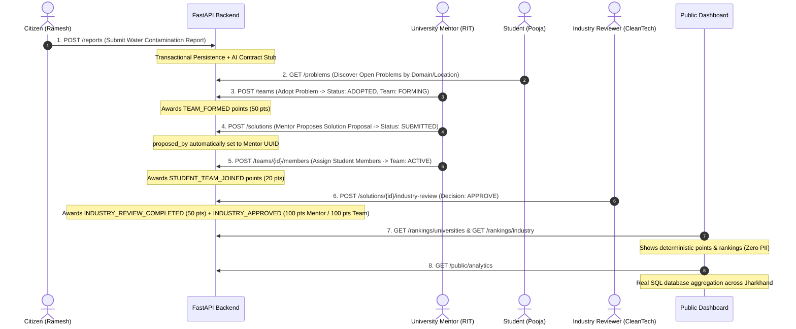

# Samanvay / JSIE — Live Presentation Demo Flow

This document provides the exact end-to-end presentation walkthrough showing how societal problems transition through citizen reporting, mentor adoption, mentor solution proposal, student team assignment, industry review, points accrual, and public transparency.

---

## 🎬 Authoritative MVP Workflow & Presentation Script



---

### Step 1: Citizen Ingestion (`POST /reports`)
1. Login as `demo.citizen@samanvay.local` with password `DevPassword123!`.
2. Post a new report with description, domain `WATER_MANAGEMENT`, and Ranchi coordinates.
3. Show `201 Created` with `status: "RECEIVED"`, `processing_status: "STUB"`.

### Step 2: Student Problem Discovery (`GET /problems`)
1. Login as `demo.student1@samanvay.local`.
2. Query `GET /problems?domain=WATER_MANAGEMENT`.
3. Highlight high priority score (92.5) and **strict zero PII** (no citizen names or private contact details).

### Step 3: University Mentor Team Adoption (`POST /teams`)
1. Login as `demo.university@samanvay.local`.
2. Adopt the problem and create `Smart Water Innovation Team`.
3. Show problem status transitions to `ADOPTED` and team status is `FORMING`.
4. Highlight that 50 `TEAM_FORMED` points are automatically recorded in `PointsEvent` and `AuditLog`.

### Step 4: University Mentor Proposes Solution (`POST /solutions`)
1. University Mentor submits solution proposal for their team:
   ```json
   {
     "team_id": "<team-id>",
     "title": "Solar-Powered Multi-Stage Arsenic Remediation Unit",
     "description": "Modular activated alumina and electro-coagulation filtration system powered by a 500W off-grid solar array."
   }
   ```
2. Server validates mentor team ownership and sets `proposed_by = mentor_id` with initial status `SUBMITTED`.

### Step 5: Adding Student Team Members (`POST /teams/{team_id}/members`)
1. Add `demo.student1@samanvay.local` and `demo.student2@samanvay.local`.
2. Show team status transition from `FORMING` to `ACTIVE`.
3. Highlight that students receive 20 `STUDENT_TEAM_JOINED` points.

### Step 6: Industry Technical Review (`POST /solutions/{solution_id}/industry-review`)
1. Login as `demo.industry@samanvay.local`.
2. Review the submitted solution (`Acoustic Strain Gauge Culvert Early Warning Sensor`) with `decision: "APPROVE"` and review comment.
3. Show automatic transactional point allocation:
   - Industry reviewer: 50 pts (`INDUSTRY_REVIEW_COMPLETED`)
   - University mentor: 100 pts (`INDUSTRY_APPROVED`)
   - Student team members: 50 pts each (`INDUSTRY_APPROVED` divided equally)

### Step 7: Public Leaderboards (`GET /rankings/universities` & `GET /rankings/industry`)
1. Open rankings endpoints (no authentication required).
2. Show deterministic ordering and total points calculated directly from the immutable ledger.

### Step 8: Public Analytics (`GET /public/analytics`)
1. Open `/public/analytics` (no authentication required).
2. Demonstrate real-time SQL aggregation of total problems, reports, teams, approved solutions, and domain distribution across Jharkhand.\n